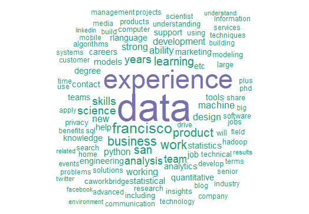

```{r setup, include=FALSE}
knitr::opts_chunk$set(echo = TRUE, message = FALSE)
```
  
## **Which are the most valued data skills?**  

### **Overview**  
In this project we were tasked with determining the most valuable data science skills

### **Introducing the Team**

* Raphael Nash - Project Manager, Fearless Leader
* Oluwakemi Omotunde - Domain SME
* Liam Byrne - Indeed scraping
* Ravi Kothari - Indeed scraping
* Dmitriy Vecheruk - Word Counts, Word Cloud
* Walt Wells - Word Counts, Data Mining
* Ahmed Sajjad - Database Creation
* Todd Weigel - Stored Procedures
* Luis Calleja - Cluster Analysis
* Jonathan Hernandez -  Cluster Analysis
* Luisa Velasco - Quality Assurance and RMarkdown
* Alex Low - Quality Assurance and RMarkdown
* Brandon O'Hara - Visualizations
* Leland Randles - Documentation and Presentation Moderator

**Instructor:** Andy Catlin  

### **Tools**  

For this exercise, we used the following tools:  
  
* Slack - collaboration  
* GitHub - file repository, Source Code Management (SCM)  
* R - web scraping, word counts, data mining  
* R Markdown - code documentation  
* MySQL - data storage  
* Tableau - visualization  
  
###**Part A: Collecting Phrases for Our Analysis**  
Our exercise was built on two foundational elements:  

1. We collected text from San Francisco job postings on Indeed.com where the words "data science" were in the job title, company name, or were keywords: http://www.indeed.com/jobs?q=%22data+scientist%22&l=san+francisco. When scraping the webpages, we have specifically focused on bullet-point lists, as these page elements are most likely to contain the necessary information on the required qualifications and skills.  

```{r warning = FALSE, eval=F}
source('Project_3.R')
```

2. We built a database of pre-defined skill keywords which were grouped into skill categories.  

```{r warning = FALSE}
skillz<- read.csv('skills_lists.csv', header = TRUE, sep = ",")
head(skillz)
```

3. We have then populated MySQL database with the predefined terms and categroies, and added procedures to read from and update the database with the counts per term as required for our analysis.
  
Using these foundations, we could do separate analyses - one which involved analyzing an unsupervised set of phrases collected directly from the Indeed webpage.  The other one involved analyzing the Indeed pages but focused on those phrases we had previously identified and stored in the DB.  
  
###**Part B: Creating Analysis-Ready Data Sets**  

We started with working with the unsupervised set of phrases to make them ready for analysis.  We parsed the text, cleaned it and counted all the key phrases. We then persisted it to a database and csv file.  Below we display the top 10 unsupervised skills as well as an associated word cloud.
  

```{r warning = FALSE}
#if (!exists('wdcnt.df.sub')) source('wordcount.R', print.eval  = TRUE)

wordcount_unsup = read.csv("https://raw.githubusercontent.com/RaphaelNash/CUNY-DATA-607-2-Group-Project/master/wordcount.csv")
knitr::kable(head(wordcount_unsup, n=10), align = "l")

```
  

  
Next we worked on the supervised set of phrases.  We again parsed and cleaned the text, but this time focused our analysis on the set of phrases we had identified. Again, we counted the phrases, and persisted them to a database and csv file.  Below we display the top 10  skills from the supervised set.

```{r warning = FALSE}
#if (!exists('skill.freq.df')) source('wordcountSuper.R', print.eval  = TRUE)

wordcount_sup = read.csv("https://raw.githubusercontent.com/RaphaelNash/CUNY-DATA-607-2-Group-Project/master/wordcountSuper.csv")
knitr::kable(head(wordcount_sup, n=10), align = "l")
```
  
Our MySQL database was updated with the results of both analyses using several stored procedures writing to the respective tables displayed in the entity-relationship diagram below.
  

  
###**Part C: Analysis and Visualization**  

Next we performed a cluster analysis of the phrases we identified from the unsupervised data sets using the stringdist function. We requested that like words be organized into 200 groups. Below you will see a couple of items:  
  
* A diagram visualizing the groupings, showing how many phrases were assigned to each group.  
* A summary of the top groups and the like phrases which were assigned to those groups.

```{r warning = FALSE}
source('cluster4upload.r', print.eval  = F)
cluster_out = read.csv("cluster_out.csv")

knitr::kable(head(cluster_out))
```
  
Finally, we have created an interactive summary of our analysis using Tableau.    
  
<iframe src="https://public.tableau.com/views/MostValuableDataScienceSkills/SkillCategoryTreeMap?:embed=y&amp:display_count=yes" width="1000" height="800"/></iframe>
